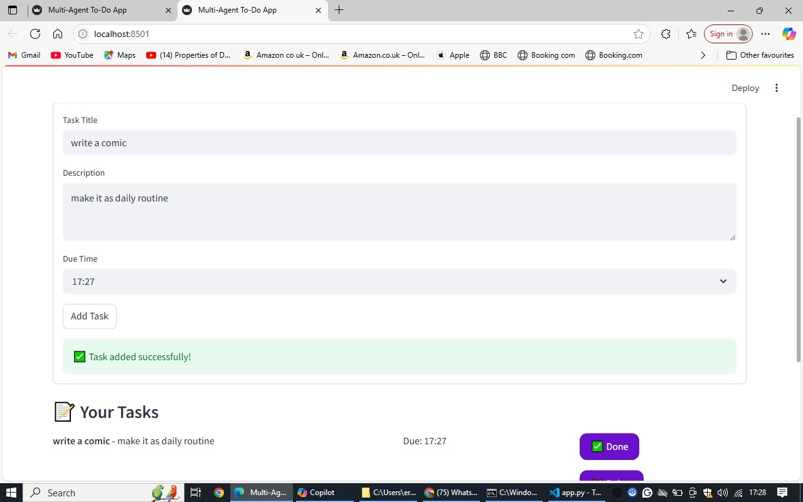
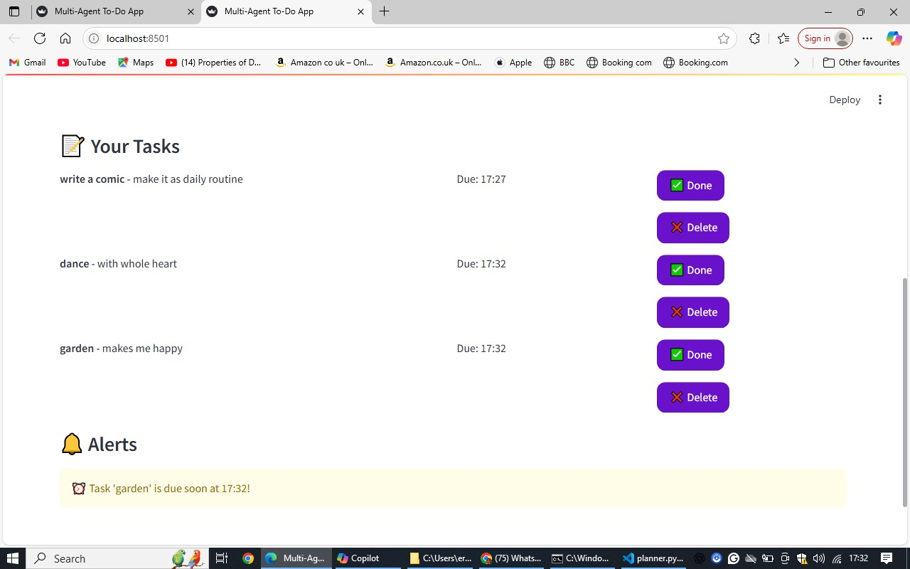
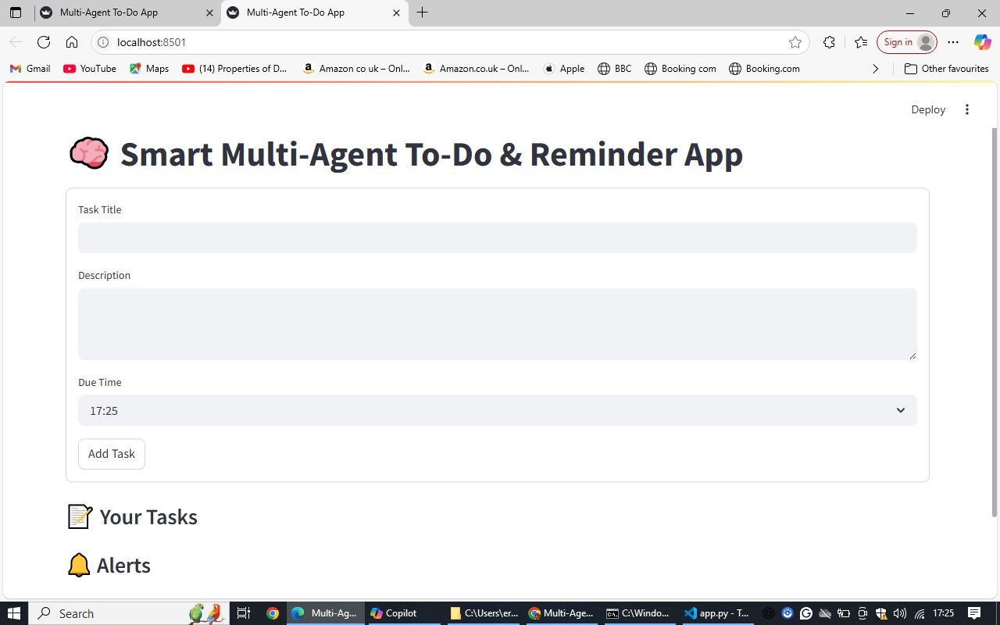

# TO-DO-
Multi-Agent To-Do &amp; Reminder App This project is a smart task management system built with multiple intelligent agents—Planner, Scheduler, and Reminder—to optimize task handling using memory and basic reasoning. Users can store tasks with reminders in SQLite or JSON, ensuring efficient task tracking. 


Sure! Here's a fun and emoji-packed `README.md` for your **Multi-Agent To-Do & Reminder App**:

---

# 🧠 Smart Multi-Agent To-Do & Reminder App 🚀  

## ✨ Overview  
Welcome to the **Smart Multi-Agent To-Do & Reminder App**! 📝✅ This app is designed to **efficiently manage tasks, schedule reminders, and detect conflicts** with your daily agenda.  

### **🌟 Features**
🔹 **Multi-Agent Functionality:** Planner, Scheduler & Reminder working together 🤖  
🔹 **Task Management:** Add, delete, or mark tasks as complete 📝✅  
🔹 **Conflict Detection:** Avoid overlapping tasks with intelligent scheduling ⚠️  
🔹 **Custom Alerts:** Get notified when tasks are due soon ⏰  
🔹 **Beautiful UI:** Styled with Streamlit & Custom CSS 🎨  

## 🛠️ Installation & Setup  
### **1️⃣ Clone the Repository**  
```sh
git clone https://github.com/your-repo/smart-todo-app.git
cd smart-todo-app
```

### **2️⃣ Install Dependencies**  
```sh
pip install -r requirements.txt
```

### **3️⃣ Initialize the Database**  
```sh
python agents/db_initializer.py
```

### **4️⃣ Run the App**  
```sh
streamlit run app.py
```

## 🎯 Usage  
👤 **Add Tasks:**  
- Enter a task title 🖊️  
- Provide a description ✍️  
- Set a due time ⏰  
- Click **"Add Task"** ✅  

🔍 **View & Manage Tasks:**  
- See your scheduled tasks on the dashboard  
- **Complete** or **Delete** tasks with a single click 🗑️  

🚨 **Get Alerts:**  
- Tasks nearing their due time will trigger alerts 🔔  
- Stay on top of deadlines effortlessly 🎯  

## 🏗️ Technologies Used  
- Python 🐍  
- **Streamlit** for UI ⚡  
- **SQLite** for Task Storage 🗄️  
- **Multi-Agent System** for Smart Scheduling 🤖 




